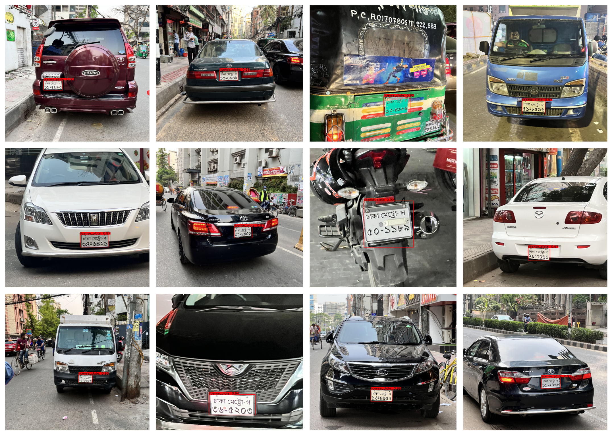

# Bangla-License-Plate-Dataset-2.5k

## Author: Naimul Haque; Mirajul Islam; Afrose Tithy; Samira Islam

This comprehensive dataset of 2519 Bangladeshi vehicle images with clearly legible Bangla license plates. The dataset contains preprocessed license plate images for detection and recognition systems.

### Download: [zenodo: Bangla License Plate Dataset 2.5k](https://zenodo.org/record/7110401#%23.Y2kp5tJByC1)
Upon downloading, you will get four directories:

1. training: Contains 2211 high-resolution Bangla license plate images of variable sizes cropped from pictures with license plates. All the files are in jpg format.

2. training_data: Contains 2211 Bangla license plate images of ‪256 x 192‬ size, resized from images from the training directory. All the files are in png format.

3. testing: Contains 200 high-resolution Bangla license plate images of variable sizes cropped from pictures with license plates. All the files are in jpg format.

4. training_data: Contains 200 Bangla license plate images of ‪256 x 192‬ size, resized from images from the testing directory. All the files are in png format. 

5. new data: Contains extra 308 images of variable size, 

## Preview

